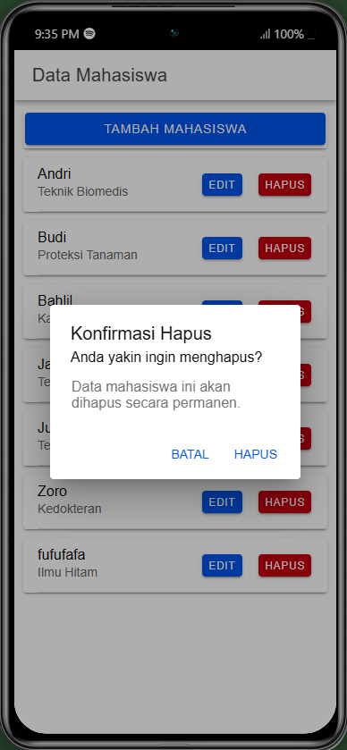

# Fitur CRUD pada Ionic

Tugas pertemuan 8 praktikum pemrograman mobile membuat CRUD Mahasiswa menggunakan ionic.

## Penjelasan Proses CRUD

### 1. Create

 

- Pengguna mengisi formulir yang terdiri dari data yang diperlukan (`nama` dan `jurusan`).
- Fungsi `tambahMahasiswa()` memeriksa apakah semua field diisi. Jika ya, data dikirimkan ke API menggunakan `this.api.tambah()` dengan endpoint `tambah.php`.
- Setelah berhasil menambahkan data, modal ditutup dan data mahasiswa terbaru diambil menggunakan `getMahasiswa()` untuk memperbarui daftar mahasiswa di tampilan.

### 2. Read

    
    
    

- Ketika halaman dimuat `ngOnInit()`, fungsi `getMahasiswa()` dipanggil untuk mengambil seluruh data mahasiswa dari API dengan endpoint `tampil.php`.
- Data yang diterima disimpan di dalam `dataMahasiswa`, kemudian ditampilkan di halaman untuk dilihat oleh pengguna.

### 3. Update

    
    
    

- Pengguna membuka modal edit dengan memilih mahasiswa tertentu yang ingin diedit, menggunakan `openModalEdit()`.
- Fungsi `ambilMahasiswa(id)` memuat data mahasiswa yang dipilih dari API `lihat.php?id=` dan mengisinya ke dalam formulir.
- Setelah data diedit dan disimpan, `editMahasiswa()` memanggil API `edit.php` untuk memperbarui data.
- Jika pembaruan berhasil, modal ditutup, data mahasiswa terbaru diambil kembali dengan `getMahasiswa()` untuk memperbarui daftar.

### 4. Delete

    
    

- Pengguna memilih opsi hapus, lalu fungsi `hapusMahasiswa(id)` memunculkan alert konfirmasi.
- Jika pengguna mengonfirmasi penghapusan, API `hapus.php?id=` dipanggil untuk menghapus data mahasiswa.
- Setelah penghapusan berhasil, `getMahasiswa()` dipanggil kembali untuk menyegarkan daftar mahasiswa di tampilan.
